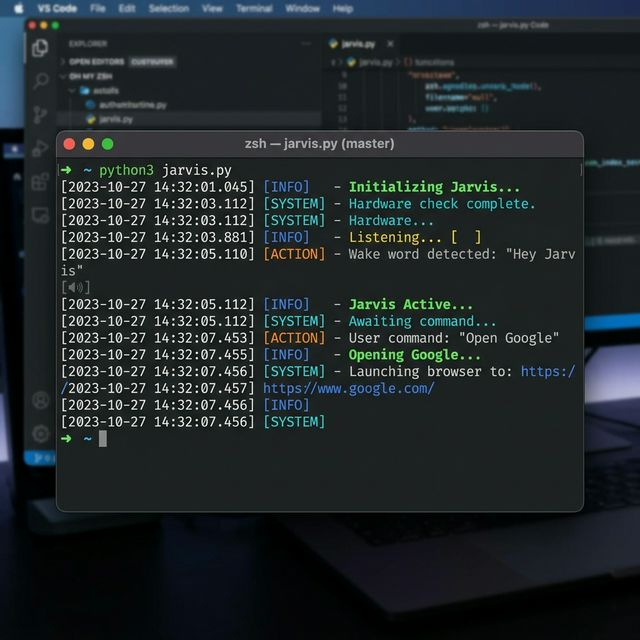

<div align="center">
  
  
  <br>

  <h1 style="margin: 0; font-size: 2.2em;">🤖 Jarvis AI</h1>
  <p><i>An intelligent, voice-activated personal assistant built with Python.</i></p>
</div>

<hr>

## 📖 Overview

Jarvis AI is a Python-based virtual assistant designed to handle general tasks, akin to Amazon Alexa or Google Assistant. It actively listens for its wake word ("Jarvis"), processes natural language voice commands, and responds with synthesized speech. By leveraging the OpenAI API, NewsAPI, and web automation, Jarvis can hold intelligent conversations, fetch the latest top news, play local music library tracks, and navigate the web on your behalf.

---

## ✨ Features

- **🗣️ Voice Activation:** Continuously listens for the wake word `"Jarvis"` to activate without needing keyboard input.
- **🧠 Generative AI Responses:** Integrates with OpenAI (`gpt-3.5-turbo`) to answer general knowledge questions and carry out tasks intelligently.
- **📰 Read the News:** Fetches and reads aloud the top headlines securely using NewsAPI.
- **🎵 Music Playback:** Plays predefined songs directly from your custom `musicLibrary` into your browser.
- **🌐 Web Navigation:** Instantly opens popular websites like Google, Facebook, YouTube, and LinkedIn based on voice commands.
- **📢 Local Text-to-Speech:** Uses dual-mode TTS containing `pyttsx3` (offline) and `gTTS` (Google Text-to-Speech) alongside `pygame` for smooth, realistic audio playback.

---

## 🚀 Working Demo

<div align="center">
  
  <p><i>Jarvis actively recognizing commands in real-time</i></p>
</div>

---

## 🛠️ Tech Stack

- **Language:** Python 3.x
- **AI & ML:** [OpenAI API](https://platform.openai.com/)
- **Voice / Speech Recognition:** `SpeechRecognition`, `pocketsphinx`
- **Text-to-Speech:** `gTTS`, `pyttsx3`
- **APIs:** `NewsAPI`
- **Audio Playback:** `pygame`

---

## ⚙️ Installation & Setup

### 1. Clone the Repository
```bash
git clone https://github.com/yourusername/jarvis-AI.git
cd jarvis-AI
```

### 2. Install Dependencies
Make sure you have Python installed. Then, run the following to install all necessary packages:
```bash
pip install SpeechRecognition pyttsx3 gTTS pygame requests openai pocketsphinx
```

### 3. Configure API Keys
You need two API keys for Jarvis to function securely:
- **OpenAI API Key:** Get it from [OpenAI](https://platform.openai.com/).
- **NewsAPI Key:** Get it from [NewsAPI](https://newsapi.org/).

Open `main.py` and replace the placeholder strings with your actual keys on **lines 15** and **42**:
```python
newsapi = "<Your_NewsAPI_Key_Here>"
# ...
client = OpenAI(api_key="<Your_OpenAI_Key_Here>")
```

---

## 🎮 Usage

Run the main script to start Jarvis:
```bash
python main.py
```

1. The console will display `Initializing Jarvis....`
2. Say the wake word **"Jarvis"** out loud.
3. Once Jarvis replies ("Ya") and the console prints `Jarvis Active...`, you can give a voice command:
   - *"Open Google"*
   - *"Play skyfall"* (defined in `musicLibrary.py`)
   - *"What is the latest news?"*
   - *"Tell me a joke."*

---

## 📁 Project Structure

```text
jarvis-AI/
├── assets/            # Screenshots and generated graphics
├── main.py            # Main application script handling voice context and commands
├── client.py          # Standalone script for testing OpenAI API connection
├── musicLibrary.py    # Dictionary mapping song names to YouTube links
└── README.md          # Project documentation
```

---

## 🤝 Contributing

Contributions, issues, and feature requests are welcome!
Feel free to check the [issues page](https://github.com/yourusername/jarvis-AI/issues) if you want to contribute.

## 📝 License

This project is open-source and available under the MIT License.
